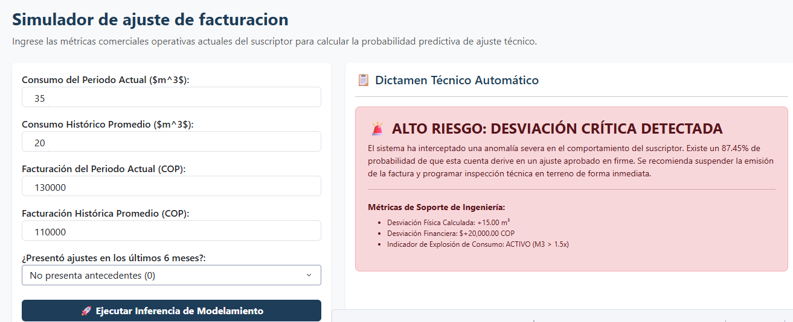

# AjustePredictor

<p align="center">
  
</p>

<p align="center">
  <strong>Sistema Analítico para identificación temprana de ajustes de facturación</strong>
</p>
# 📊 Ajuste predictor

## 📋 Descripción

**Ajuste predictor** es una solución analítica de nivel empresarial desarrollada con **Python**, **Dash** y **Plotly** diseñada para interceptar, evaluar y predecir anomalías en la facturación de servicios públicos. 

El sistema combina técnicas avanzadas de **Análisis Exploratorio de Datos (EDA)** con un motor de inferencia interactivo respaldado por un pipeline optimizado de **Machine Learning (Gradient Boosting Classifier)**, permitiendo mitigar el impacto financiero y optimizar los costos de inspección operativa antes de la emisión final del documento de cobro.

---

## 🎯 Objetivos

* **Análisis Histórico Operativo:** Examinar patrones probabilísticos sobre el comportamiento de cuentas corregidas en el ciclo comercial.
* **Ingeniería de Características:** Identificar y aislar variables con alto potencial predictivo (desviaciones volumétricas y financieras).
* **Mitigación de Pérdidas:** Detectar en la fase de precrítica explosiones de consumo y desviaciones monetarias críticas.
* **Inferencia Interactiva:** Disponer de un simulador en tiempo real acoplado a sistemas basados en reglas de negocio para la toma de decisiones gerenciales.

---

## 🏗️ Estructura del proyecto

```text
ajuste-predictor/
│
├── app.py                      # Servidor central, enrutador dinámico y callbacks del simulador
│
├── data/
│   ├── __init__.py
│   ├── data_loader.py          # Script de ingesta y procesamiento de la línea base
│   ├── DataAjuste.csv          # Base de datos histórica (659,856 registros)
│   └── ajuste_predictor_model.pkl # Pipeline entrenado de Scikit-Learn (Escalador + Gradient Boosting)
│
├── tabs/
│   ├── __init__.py
│   ├── contextoproblema.py     # KPIs estratégicos, impacto financiero y tasa de desbalanceo
│   ├── metodologia.py          # Documentación del flujo científico e hipótesis de negocio
│   ├── eda.py                  # Módulo de gráficos interactivos bidimensionales y correlaciones
│   └── modelo.py               # Interfaz del simulador quirúrgico de inferencia en precrítica
│
├── assets/
│   └── custom.css              # Estilos corporativos personalizados para la interfaz de usuario
│
├── screenshots/
│   └── home.png
│
├── docs/
│   └── arquitectura.md
│
├── requirements.txt            # Dependencias del ecosistema analítico (Dash, Scikit-Learn, Pandas)
├── README.md

## ⚙️ Requisitos


Antes de ejecutar el proyecto asegúrate de tener instalado:


* Python 3.9 o superior

* Pip

* Git (opcional)


Verifica tu versión de Python:


```bash

python --version

```


---


## 🚀 Instalación


### 1. Descargar el proyecto


Simplemente descarga y descomprime el proyecto.


---


### 2. Crear entorno virtual


#### Windows


```bash

python -m venv venv

venv\Scripts\activate

```


#### Linux / Mac


```bash

python -m venv venv

source venv/bin/activate

```


---


### 3. Instalar dependencias


```bash

pip install -r requirements.txt

```


---


## 📁 Dataset Requerido


El proyecto utiliza el archivo:


```text

DataAjuste_variableajustada.csv

```

**Fue compartido a su correo**


Ubicación esperada:


```text

data/DataAjuste_variableajustada.csv

```

